# Synchronization

How a note moves between the vault and Anki, which side wins, and what each
command covers. Code lives in `src/services/sync.ts` (the `Sync` command),
`src/services/export.ts` (the `Export to Anki` command) and
`src/services/import.ts` (the `Import deck from Anki` wizard).

## Single source of truth

The transition table in `src/services/note-lifecycle.ts`. The xstate machine is
derived from it (never edited directly); the diagram below is generated by
`noteLifecycleMermaid()` from the same table. Entry into the machine happens by
classification, not from a start state — every state is a possible entry point.

```mermaid
stateDiagram-v2
  ankiOnly_neverImported["ankiOnly.neverImported"]
  ankiOnly_fileDeleted["ankiOnly.fileDeleted"]
  synced_clean["synced.clean"]
  synced_ankiNewer["synced.ankiNewer"]
  synced_vaultNewer["synced.vaultNewer"]
  synced_diverged["synced.diverged"]
  linked_unenrolled["linked.unenrolled"]
  vaultOnly_unexported["vaultOnly.unexported"]
  vaultOnly_unenrolled["vaultOnly.unenrolled"]
  vaultOnly_ankiDeleted["vaultOnly.ankiDeleted"]
  orphaned["orphaned"]
  ankiOnly_neverImported --> synced_clean: IMPORT
  ankiOnly_neverImported --> ankiOnly_neverImported: SKIP
  ankiOnly_fileDeleted --> synced_ankiNewer: RESURRECT
  ankiOnly_fileDeleted --> orphaned: PURGE
  synced_clean --> synced_clean: CHECK
  synced_ankiNewer --> synced_clean: PULL
  synced_ankiNewer --> synced_clean: FORCE_PUSH
  synced_vaultNewer --> synced_clean: PUSH
  synced_vaultNewer --> synced_clean: FORCE_PULL
  synced_vaultNewer --> synced_clean: RESOLVE_NEWEST
  synced_diverged --> synced_clean: FORCE_PULL
  synced_diverged --> synced_clean: FORCE_PUSH
  synced_diverged --> synced_clean: RESOLVE_NEWEST
  linked_unenrolled --> synced_clean: ENROLL
  vaultOnly_unexported --> synced_clean: EXPORT
  vaultOnly_unenrolled --> synced_clean: ENROLL
  vaultOnly_ankiDeleted --> orphaned: DELETE_FILE
  vaultOnly_ankiDeleted --> synced_clean: EXPORT
  orphaned --> orphaned: PURGE
```

## Events

- IMPORT: Anki-only note enters the vault (ankiOnly.neverImported -> synced.clean).
- EXPORT: a vault-only note is created in Anki, ID written back (vaultOnly.unexported -> synced.clean); the same event recreates a note that was deleted in Anki when the user forces that one note with "Obsidian wins" (vaultOnly.ankiDeleted -> synced.clean).
- PULL: Anki side is newer, overwrite the vault note (synced.ankiNewer -> synced.clean). Issued by Sync and by the import wizard.
- PUSH: vault side is newer, update Anki (synced.vaultNewer -> synced.clean). Issued by Sync and by the export wizard.
- RESOLVE_NEWEST: Sync resolves a note edited on both sides by clocks, never the wizards (synced.diverged -> synced.clean; the table also allows it from synced.vaultNewer for flows that deliberately overwrite vault content). Anki mod in seconds vs file mtime in ms.
- FORCE_PULL: the user marked one note "Anki wins" in the import wizard although its vault side is newer, so Anki's version is written over it (synced.vaultNewer / synced.diverged -> synced.clean). Only the wizard issues it, always per note, and only when that note is marked; where the default already takes Anki's version (a new note, an Anki-newer note) marking it changes nothing, and a clean note is never overwritten because the toggle is on.
- FORCE_PUSH: the mirror image - the user marked one note "Obsidian wins" in the export wizard, so the vault version is written to Anki even though Anki's side is newer or the note was edited in both places (synced.ankiNewer / synced.diverged -> synced.clean). Same rules as FORCE_PULL: per note, off by default, counted in the report, and no effect where the export already takes the vault version.
- ENROLL: link by ID with no sync record, store mod + hash as baseline (linked.unenrolled / vaultOnly.unenrolled -> synced.clean).
- RESURRECT: a vault-deleted file comes back because Anki is newer (ankiOnly.fileDeleted -> synced.ankiNewer), or because the user marked that one note "Anki wins" in the import wizard; that forced import also clears the tombstone once UC-30 persists one.
- DELETE_FILE: note is gone in Anki, delete the vault file (vaultOnly.ankiDeleted -> orphaned).
- PURGE: drop stale sync records (ankiOnly.fileDeleted / orphaned -> orphaned).
- SKIP: leave an unimported note alone (ankiOnly.neverImported -> ankiOnly.neverImported).
- CHECK: confirm a clean note is still clean, no-op (synced.clean -> synced.clean).

Any event not listed for a state is rejected by `transitionNoteLifecycle`
with an error — a note accepts only its state's operations.

## Ledger

`settings.noteLifecycle` is the single ledger for both directions, keyed by Anki
note ID: `{ lastHash, lastMod, status, updatedAt, v }`.

- `lastHash` — content hash of the vault block (`front\nback\ntags\nmodel`), so
  dirtiness is decided by content, never by timestamps alone.
- `lastMod` — Anki's `mod` (unix seconds) as of the last successful sync.
- `status` — the last known lifecycle state, for badges in the UI.

There are no migrations: the shape is fresh and there are no production users,
so a dev ledger can be discarded freely.

## Which side wins

Every row is decided by `classifyNoteLifecycle` (`block hash vs lastHash`,
`anki.mod vs lastMod`) and then acted on by `importActFor` /
`transitionNoteLifecycle`. The report counters are the fields of
`SyncDeckReport` / `SyncReport` in `src/services/sync.ts`; `Sync` uses
`syncActFor`, the import wizard uses `importActFor`, so the same table yields a
different allowed action per command.

| State | Condition | Action | Winner | Counter |
| --- | --- | --- | --- | --- |
| `synced.clean` | block hash equals `lastHash`, Anki `mod` not newer | CHECK (no-op) | nothing changes | `upToDate` |
| `synced.vaultNewer` | block hash differs, Anki `mod` not newer | PUSH: `updateNoteFields` plus `changeDeck` grouped per deck | vault | `pushed` |
| `synced.ankiNewer` | block hash equals `lastHash`, Anki `mod` newer | PULL: file rewritten from Anki | Anki | `refreshed` |
| `synced.diverged` | both sides changed | `isAnkiNewer` decides: PULL when Anki is newer, otherwise PUSH | newest side | `refreshed` or `pushed` |
| `linked.unenrolled` | block has an ID, no ledger record | ENROLL: baseline hash from the Anki side, then re-classify | decided by the row above | `enrolled`, then the follow-up counter |
| `ankiOnly.fileDeleted` | ledger record exists, block or file gone | `Sync` only counts it and the import wizard only offers it; the resurrect-or-purge verdict is UC-30, an explicit "Anki wins" resurrects right now | decided in UC-30 | `missing` |
| record without a live Anki note | not returned by `findNotes` | block removed from its file, record deleted | Anki | `deleted`, `purgedRecords` |
| model without a pack | no built-in pack, no saved pack JSON | skipped, never guessed | none | `skippedUnmapped` |
| block or file missing | no vault side to compare | skipped, never recreated | none | `missing` |
| `vaultOnly.unexported` | block without an ID, nothing in Anki | not part of `Sync`; the export wizard creates the note | n/a | not counted |
| `vaultOnly.ankiDeleted` in the export wizard | block has an ID, the Anki note is gone | skipped as deleted; a forced row recreates the note (EXPORT) | none / user | `skippedDeleted` |
| `synced.diverged` in the export wizard | both sides changed | not resolved by clocks in a wizard: skipped, or pushed when the row is forced | user | `skippedForSync` |

The vault always wins the deck: the target deck is derived from the file path
(`deckForPath`) and enforced with `changeDeck` on every push, so moving a note
between decks in Anki is undone by the next sync.

## Clocks and ties

- Dirtiness is hash-first: a note is only "newer" on a side when its content
  hash differs, so our own writes never look like a foreign change.
- The clock comparison is Anki `mod` (unix seconds) against
  `TFile.stat.mtime` (milliseconds) in `isAnkiNewer` (`src/services/note-push.ts`).
- Clocks are used by `Sync` only. A wizard never resolves a diverged note by
  comparing timestamps: it either asks the user (force) or leaves the note to
  `Sync`. Ties (less than a second apart) currently go to the vault. A
  configurable `syncTieWinner` plus a threshold and a tie report is still open
  (UC-32).
- After any write to Anki the ledger stores the real post-write `mod` (a
  `notesInfo` round trip), so the next run is a no-op instead of a
  ping-pong of "newer" verdicts.

## Deletions

AnkiConnect exposes no deletion timestamp, so a missing file is resolved by
comparing Anki's `mod` with `lastMod`: Anki is newer
means RESURRECT (the file comes back from Anki), otherwise PURGE (the record is
dropped). A note that disappeared from Anki entirely loses its block and its
record; the file is deleted when nothing else remains in it.

## Command scopes

The import wizard is pull-only (done): it never writes to Anki and never resolves
deletions on its own. Every row offers "Anki wins", a per-note force that takes
Anki's version whatever the state: a newer vault note is overwritten
(`FORCE_PULL`, reported as `forced`), a deleted file is re-created
(`RESURRECT`), and a note the import would write anyway is unchanged. Without
that force a vault-newer note is reported as `skipped (newer in Obsidian)` and a
note whose file is gone as `left to Sync (no file)`. The export wizard is the
mirror image (deck-first, pushes what changed in Obsidian, "Obsidian wins"
per note); the deck-first version is still UC-36, the bulk engine that
implements the same rules already exists. `Sync` is the only command that
resolves clocks and deletions. The rest of this section describes what the
commands do today.

- `Import deck from Anki` — Anki to vault for one chosen deck: model
  discovery, field mapping, per-note decisions, media download.
- `Export to Anki` — vault to Anki over a full vault scan (respecting
  `ignoredDirectories`): creates notes for blocks without an ID, pushes blocks
  that changed in Obsidian, writes IDs back, uploads media, reports what it
  skipped. A note edited in both places, a note newer in Anki and a note
  deleted in Anki are never resolved here by a guess: they are counted as
  `left to Sync`, and the per-row force "Obsidian wins" (`FORCE_PUSH`, plus
  `EXPORT` for a note deleted in Anki) is the only way to write the Obsidian
  version anyway. The deck-first wizard that mirrors the import wizard is UC-36;
  this command is the bulk engine behind it. Models are assured on demand:
  after planning, only the models the planned creates need are checked and the
  missing ones created, and a note of a mismatched or name-colliding model is
  dropped and counted (`skipped on model mismatch`) instead of being written
  into someone else's notetype. A push reuses the Anki note's own model, so
  pushes are never assured.
- `Sync` — bidirectional maintenance of the notes both wizards have already
  introduced, and the only command that resolves clocks: it first fills missing
  block IDs by hash, then walks the decks from `deckImportSnapshots` and applies
  the table above. Making the ledger its scope is UC-28.
- `Purge ledger` — a rare cleanup action in the command palette, vault-only (no
  Anki needed). It forgets every ledger record whose id is nowhere in the vault,
  and keeps the rest: records with a live block, records in ignored folders
  (out of scope) and records whose block cannot be read (unreadable, never
  guessed). It never touches files. Afterwards the import wizard offers the
  forgotten notes as new again.

### Known limitations (tracked as UC-28 and UC-33 in TODO.md)

- A note added in Anki to a deck that was imported earlier is skipped silently:
  it has neither a ledger record nor a block, so it is not counted and not
  reported. The import wizard remains the only way to bring it in.
- A note exported to a deck that is not in `deckImportSnapshots` is outside
  `Sync`'s reach even though the ledger knows it: it is neither read nor
  updated. A purge only ever removes records whose note Anki confirms is
  gone, so such a record is safe. Making the ledger the scope (with the deck
  stored on the record) would cover it too and is the remaining scope of
  UC-28. Ignored directories are plugin-wide in UC-33.
